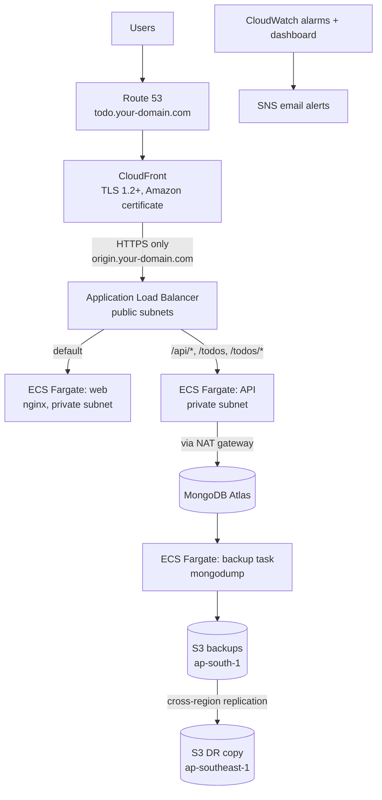

# Todo Application on AWS

A full-stack todo application (Angular web front end, Node.js API, MongoDB) deployed to AWS as a production-like environment. Every change is tested, scanned, versioned, built into a container image and deployed to Amazon ECS automatically. The platform is served through Amazon CloudFront over HTTPS, backed up to S3, replicated to a second region and monitored with Amazon CloudWatch.

**Live URL:** https://todo.your-domain.com

| Link | URL |
|---|---|
| Application | https://todo.your-domain.com |
| Web health check | https://todo.your-domain.com/healthz |
| API health check | https://todo.your-domain.com/api/health |
| Architecture report | `docs/Todo-AWS-Architecture-Report.pdf` |
| Disaster recovery runbook | `docs/DR-RUNBOOK.md` |

## Contents

- [Architecture](#architecture)
- [Technology stack](#technology-stack)
- [AWS services used](#aws-services-used)
- [Repository structure](#repository-structure)
- [CI/CD pipeline](#cicd-pipeline)
- [Docker](#docker)
- [Security](#security)
- [Backup and disaster recovery](#backup-and-disaster-recovery)
- [Monitoring](#monitoring)
- [Run locally](#run-locally)
- [Deployment and releases](#deployment-and-releases)
- [Documentation](#documentation)
- [Known limitations](#known-limitations)

## Architecture



**Request path.** The browser resolves `todo.your-domain.com` through Route 53 to CloudFront. CloudFront terminates TLS and either serves cached web content or forwards the request over HTTPS to the load balancer. The load balancer routes API paths to the API service and everything else to the web service. Both services run in private subnets with no public IP. The API reaches MongoDB Atlas through the NAT gateway.

**Network.** One VPC (`10.0.0.0/16`) across two availability zones with three subnet tiers: public (load balancer, NAT gateway), private app (ECS tasks) and private DB (reserved). Each tier has its own route table.

**Three tiers.**

| Tier | Component | Exposure |
|---|---|---|
| Web | CloudFront, ALB, nginx | Only CloudFront can reach the load balancer |
| Application | API on ECS Fargate | Reachable only from the load balancer |
| Data | MongoDB Atlas | Access limited to the NAT gateway address |

## Technology stack

| Area | Technology |
|---|---|
| Web | Angular, served by nginx (unprivileged) |
| API | Node.js |
| Database | MongoDB Atlas |
| Containers | Docker, multi-stage builds |
| CI/CD | GitHub Actions, semantic-release |
| Security scanning | Gitleaks, Trivy, npm audit |
| Cloud | AWS (see below) |

## AWS services used

| Service | Purpose |
|---|---|
| VPC, subnets, route tables, internet gateway, NAT gateway | Network with public, private app and private DB tiers |
| Security groups | Layered access control between load balancer, web and API |
| ECS on Fargate | Runs the web, API and backup containers without managing servers |
| ECR | Stores the container images |
| Application Load Balancer | HTTPS listener, path-based routing, health checks |
| CloudFront | HTTPS front door, caching of web content, uncached API paths |
| Route 53 | DNS for the public name and the origin name |
| ACM | Publicly trusted certificates issued by Amazon (no self-signed certificates) |
| Secrets Manager | Database connection string, injected into containers at start-up |
| S3 | Encrypted, versioned backup storage with lifecycle retention, cross-region replication |
| IAM and OIDC | Least-privilege roles, keyless deployment from GitHub Actions |
| CloudWatch | Metrics, Container Insights, logs, alarms, dashboard, Logs Insights |
| SNS | Email notifications for alarms |

## Repository structure

```text
.
|-- apps/
|   |-- web/                 Angular front end (Dockerfile, nginx.conf)
|   `-- api/                 API (Dockerfile)
|-- backup-job/              Backup and restore image (backup.sh, restore.sh, Dockerfile)
|-- docs/                    Architecture report (PDF) and disaster recovery runbook
|-- .github/workflows/
|   |-- ci.yml               Test, validate, version, call deploy
|   `-- deploy.yml           Build, scan, push, deploy to ECS
`-- package.json             Release tooling (semantic-release)
```

## CI/CD pipeline

Branches: work happens on feature branches and is merged into `develop` through pull requests. `develop` is promoted to `main` through a pull request. The pipeline runs on every push and pull request for both branches, and a merge to `main` produces a release and a deployment.

| Stage | Jobs | Purpose |
|---|---|---|
| 1. Test | Lint, unit tests, production build for web and API | Prove the code builds and passes. Build output kept 14 days |
| 2. Validate | Gitleaks, Trivy filesystem scan, `npm audit`, gate | Block leaked secrets and high or critical vulnerabilities |
| 3. Version | semantic-release (main only) | Next version from Conventional Commit messages, tag and GitHub release |
| 4. Deploy | Build, Trivy image scan and SBOM, push to ECR, deploy to ECS | Deploy only a clean image, wait for the service to stabilize |

**Commit messages** follow Conventional Commits: `feat:` creates a minor release, `fix:` a patch release. `ci:`, `docs:` and `chore:` do not create a release.

**Image tags.** Every image gets the commit SHA tag. A version tag such as `v1.0.1` is added only when a release is created. ECR repositories are immutable, so a tag always points to exactly one image.

**Artifacts.** Build output (14 days), SBOM in CycloneDX format and Trivy report per image (30 days), container images in ECR, releases on GitHub.

**Safe delivery.** Deployments are serialized, ECS waits up to 10 minutes for stability, and the ECS deployment circuit breaker rolls back a failing release automatically.

## Docker

| Practice | Applied |
|---|---|
| Multi-stage builds | Separate build, production-dependency and runtime stages |
| Non-root runtime | API runs as the `node` user. Web uses nginx-unprivileged on port 8080 |
| Small base images | Alpine based, OS packages upgraded during the build |
| Reproducible installs | `npm ci` with lock files and `.dockerignore` |
| Reduced attack surface | npm, npx, corepack and yarn removed from the API runtime image. Production dependencies only |
| Health checks | `HEALTHCHECK` in the web image, plus ECS and load balancer health checks |
| Scan before push | Trivy scans the image before it is pushed to ECR |

## Security

| Control | Implementation |
|---|---|
| Keyless deployment | GitHub authenticates to AWS with OIDC. The role can be assumed only by this repository's `main` branch. No AWS access keys are stored |
| Secrets | The database connection string lives in AWS Secrets Manager and is injected at container start. It is not in code, images or task definition text |
| Secret scanning | Gitleaks runs on every change |
| Dependency and image scanning | Trivy (filesystem and image) and `npm audit` fail the build on fixable high or critical findings. An SBOM is kept for every image |
| Network isolation | ECS tasks run in private subnets without public IPs. Security groups reference each other: web and API accept traffic only from the load balancer |
| Single entry point | The load balancer accepts HTTPS only from the CloudFront managed prefix list. Direct access to the origin hostname times out |
| Encryption in transit | HTTPS from viewer to CloudFront (TLS 1.2 minimum) and from CloudFront to the origin. HTTP is redirected to HTTPS |
| Trusted certificates | Public certificates issued by Amazon ACM with DNS validation. No private or self-signed certificates |
| Encryption at rest | Backups in S3 use AES-256 encryption, versioning and a public access block |
| Least privilege IAM | The backup role can only write and read the backup folders of one bucket. The deploy role is restricted to one repository and branch |
| Immutable releases | ECR tag immutability prevents overwriting a released image |
| Database access | MongoDB Atlas access list limited to the NAT gateway address |

## Backup and disaster recovery

MongoDB Atlas M0 has no managed backup, so a logical backup runs inside the same ECS environment.

| Item | Design |
|---|---|
| Backup | ECS Fargate task runs `mongodump` and uploads the archive to S3. Credentials come from Secrets Manager |
| Frequency | Daily (recovery point objective 24 hours). The job is started on demand |
| Retention | `daily/` 7 days, `weekly/` 30 days (S3 lifecycle rules) |
| Storage | S3 with versioning, AES-256 encryption, public access blocked |
| Restore | A restore task restores an archive into a separate database `todo_restore` and compares document counts with the live data |
| DR copy | S3 cross-region replication to `ap-southeast-1` |

| Scenario | RPO | RTO target | Result | Status |
|---|---|---|---|---|
| Service failure | 0 | 15 min | 59 seconds measured | Tested |
| Data loss | up to 24 h | 30 min | Restore job 5 seconds | Tested |
| Region failure | up to 24 h plus replication delay | 60 min | Estimated | Documented only |

Run a backup and read the result:

```bash
aws ecs run-task --cluster myapp-dev-ecs --task-definition myapp-backup-task \
  --launch-type FARGATE --region ap-south-1 \
  --network-configuration "awsvpcConfiguration={subnets=[<APP_SUBNET_A>,<APP_SUBNET_B>],securityGroups=[<API_SG>],assignPublicIp=DISABLED}"

aws logs tail /ecs/myapp-backup-task --since 10m --region ap-south-1
```

The log must contain `BACKUP_OK`. The full procedures, including restoring into the live database and recovering from a region failure, are in `docs/DR-RUNBOOK.md`.

## Monitoring

| Signal | Detail |
|---|---|
| Alarms (10) | ALB 5xx, unhealthy hosts (web, API), running tasks low (web, API), CPU high (web, API), memory high (web, API), backup missing |
| Notifications | Each alarm emails through an SNS topic when it goes to ALARM and when it returns to OK |
| Dashboard | Alarm status, ALB requests and 5xx, response time, ECS CPU, memory and running tasks |
| Logs | Web, API and backup logs in CloudWatch Logs (30 days), Container Insights enabled |
| Investigation | Dashboard to find the signal that changed, ECS service events to see why tasks stopped, CloudWatch Logs Insights saved query for API errors |

## Run locally

Requirements: Node.js 22, npm, Docker.

```bash
# API: install, lint, test, build
cd apps/api
npm ci
npm run lint --if-present
npm test
npm run build

# Web: install, lint, test, build
cd ../web
npm ci
npm run lint --if-present
npm test -- --watch=false
npm run build -- --configuration production
```

Build and run the containers:

```bash
docker build -t todo-web apps/web
docker build -t todo-api apps/api

docker run --rm -p 8080:8080 todo-web
docker run --rm -p 3000:3000 \
  -e NODE_ENV=production -e PORT=3000 \
  -e MONGODB_URI="<your MongoDB connection string>" \
  todo-api
```

The API reads its configuration from environment variables (`PORT`, `NODE_ENV`) and the secret `MONGODB_URI`. Never commit connection strings. In AWS the connection string comes from Secrets Manager.

## Deployment and releases

1. Create a branch, commit with a Conventional Commit message and open a pull request into `develop`.
2. When the checks pass, merge. Promote `develop` to `main` with a pull request.
3. On `main`, the pipeline creates a version (when the commits warrant one), scans, pushes the image and deploys both services.
4. Verify the deployment with the health checks https://todo.your-domain.com/healthz and https://todo.your-domain.com/api/health:

```bash
curl -s -o /dev/null -w "%{http_code}\n" https://todo.your-domain.com/healthz
curl -s -o /dev/null -w "%{http_code}\n" https://todo.your-domain.com/api/health
```

Both must return `200`. A failing deployment rolls back automatically. To roll back manually, update the ECS service to a previous task definition revision.

## Documentation

| Document | Content |
|---|---|
| `docs/Todo-AWS-Architecture-Report.pdf` | Architecture diagrams, implementation, design decisions, results, limitations |
| `docs/DR-RUNBOOK.md` | Recovery objectives, detection, recovery procedures for service, data and region failures, test log |

## Known limitations

| Limitation | Production recommendation |
|---|---|
| Backup job is started manually. The daily frequency is the design target | EventBridge daily schedule |
| Atlas M0 has no point-in-time recovery or private connectivity | Paid Atlas tier with Cloud Backup and PrivateLink or VPC peering |
| One NAT gateway in a single availability zone | One NAT gateway per availability zone |
| No VPC endpoints, AWS API traffic uses the NAT gateway | Endpoints for ECR, S3, CloudWatch Logs and Secrets Manager |
| Outbound traffic is not restricted | Limit egress per security group |
| ECR images and secrets are not replicated to the DR region | Enable ECR and secret replication |
| Region failover procedure has not been executed | Run a full DR exercise |
| No manual approval before production deployment | Protected GitHub environment |